## spring源码介绍和编译

### spring体系架构（基于4.x）

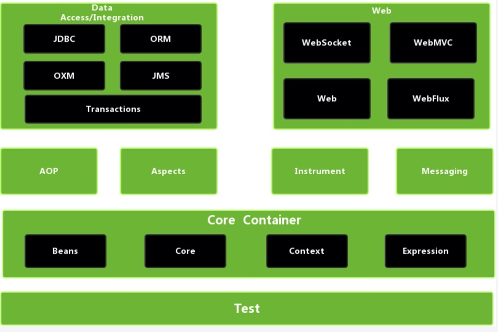

为什么是基于4.x的版本的呢？

因为在4.x以后，spring官方推荐使用springboot开发，因为springboot可以让你省去一些规范上的各种配置，只要加上一个starter依赖就可以了，变相的忽略了里面各个模块 ，所以在spring 5以后，就没有这张图了，但是我们分析spring源码是基于spring5的，所以在这里图就贴spring4.x的了。

****

#### 核心容器（Core Container）

该模块主要包含Core、Beans、Context和SpEL模块。其中Core和Beans是整个框最基础的部分，提供IOC和依赖注入特性。这里最重要的概念就是BeanFactory，提供了以Factory模式的实现

**Core：模块主要包含Spring框架最基本的核心工具类，Core是其他组件的基础核心**

**Beans：模块主要包含访问配置文件、创建/管理Bean以及IOC/DI相关的类**

**Context：继承Beans的特性，主要为Spring提供大量的扩展，如国际化、事件机制、资源加载等等。ApplicationContext接口是Context模块的关键。**

**SpEL：模块提供了一个强大的表达式**

****

#### AOP and Instrumentaion

提供符合AOP Aliance标准的面向切面编程的实现，可以让你定义拦截器和切点，从而降低程序的耦合性。

**AspectJ模块：提供了与AspectJ的继承**

**Instrumentaion模块：提供用于某些应用程序服务器的类工具支持和类加载器实现**

****
#### Message

该模块具有来自Spring Integration项目的关键抽象，如Message、MessageChannel、MessageHandler等。他们构成基于消息的应用程序的基础。该模块还包括一组注释，用于将消息映射到方法，类似springMVC注释的编程模型。

****

   
#### Data Access/Integration

数据访问/集成层由JDBC、ORM、OXM、JMS和事务模块组成。

**JDBC模块：提供了JDBC抽象层，从而无需进行频繁的JDBC编码和数据库特定错误代码（不同数据代码可能不同）的解析。**

**事务模块：支持对实现特殊接口的类以及所有POJO（普通Java对象）进行编程和声明式事务管理。**

**ORM模块：该模块为当前流行的ORM（JPA、Mybatis、Hibernate）提供了集成层。使用ORM模块，可以将所有的O/R映射框架与spring提供的所有功能结合使用，如前面提到的事务管理功能。**

**OXM模块：提供了一个抽象层，该抽象层支持Object/XML映射实现，例如JAXB、Castor、XMLBeans、JiBX和XStream。**

**JMS模块（JAVA Message Service）：包含用于生成和使用消息的功能。从spring framework 4.1 开始，提供了spring-messaging模块集成**

****

#### Web

Web上下文模块建立在应用程序上下文模块之上，为基于Web的应用程序提供上下文支持。该模块包含Web、WebMVC、WebSocket和Web-Porlet模块。

**Web模块：提供了基本的面向Web的集成功能，如文件上传功能以及使用Serlvet监听器和面向Web的应用程序上下文对IOC容器的初始化。**

**WebMVC模块（也称为Web-Serlvet模块）：包含基于Spring的Model-View-Controller（MVC）支持和针对Web应用程序的Rest Web服务实现。**

**Web-Portlet模块：提供Portlet环境中的MVC实现。**

****


#### Test模块

该模块支持使用JUnit或者TestNG对Spring组件进行单元测试和集成测试。

****


### 源码环境搭建


#### 下载源码

##### 登录github

https://github.com/spring-projects/spring-framework

##### 选择RELEASE版本

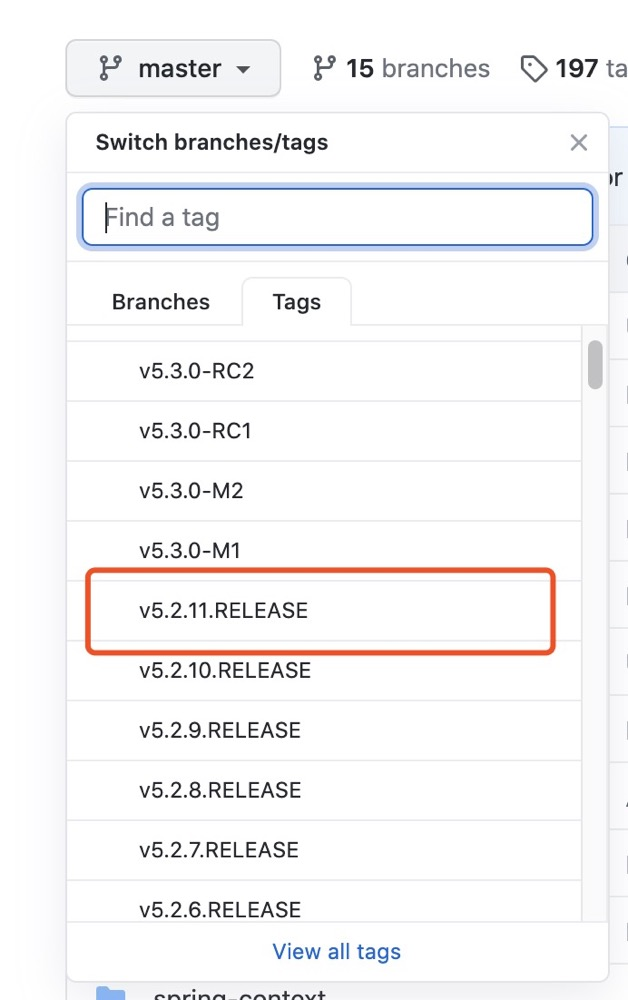


##### 下载源码

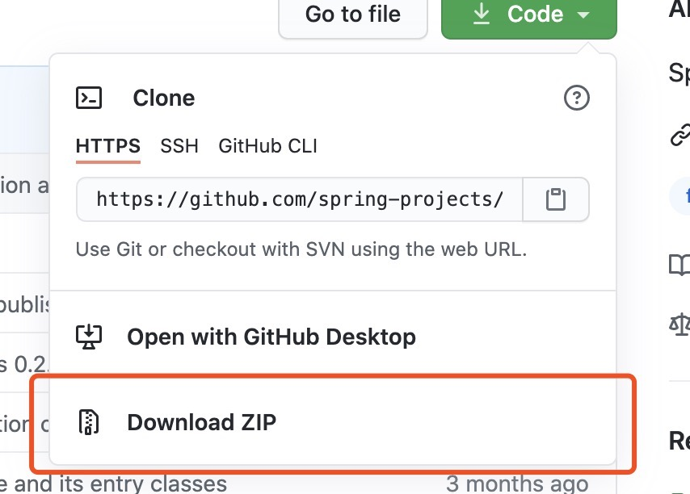


##### 解压源码


#### 编译源码

##### 构建工具准备

安装源码对应的gradle版本(也可不安装)，建议使用gradleWraper中的gradle(spring解压出来的包中有gradleWraper)

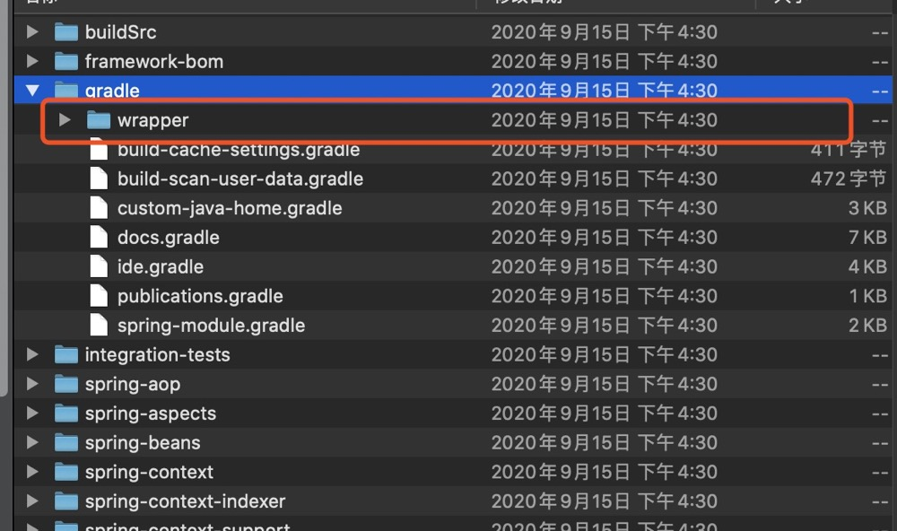

进去wrapper里面去看，有一个gradle-wrapper.properties

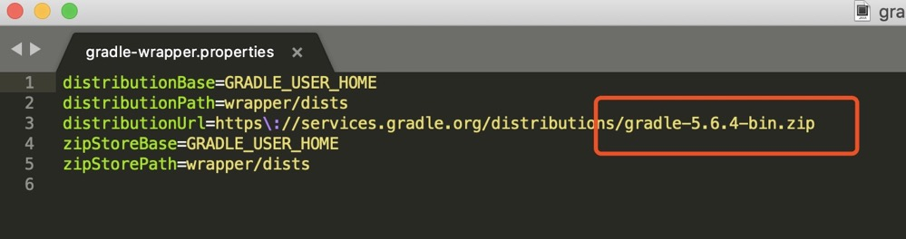

这里面呢就会告诉要编译这份源码，spring会携带一个远程的一个gradle服务，所以会自动帮你下载这个版本(省去下载gradle的步骤)

##### 修改编译文件

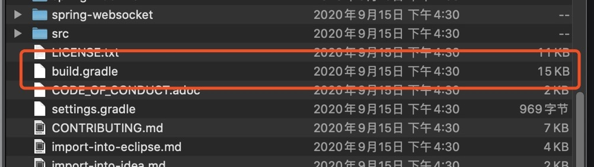

这个文件相当于Maven中的pom.xml

第一步：修改镜像

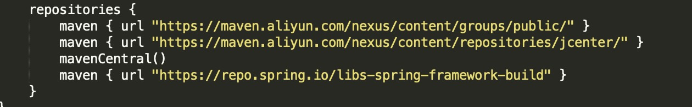

配置阿里云的镜像，maven拉取包的时候会快很多

##### 编译

编译compile TestJava模块

打开源码所在文件夹，输入：

mac: ./gradlew :spring-oxm:compileTestJava
windows: gradlew :spring-oxm:compileTestJava

接下来就是等待漫长的下载依赖过程...（时间快慢看网速），直到出现xxx  SUCCESS

(第一次编译，因为要远程的去下载gradle，所以会很慢很慢，你可以听首歌，喝杯茶)


看到下面的build successful就表示成功了，下面的报错可以忽略

第一次编译用时：15分钟（在下的渣渣电脑）


##### 导入idea

用idea打开刚刚编译后的项目目录

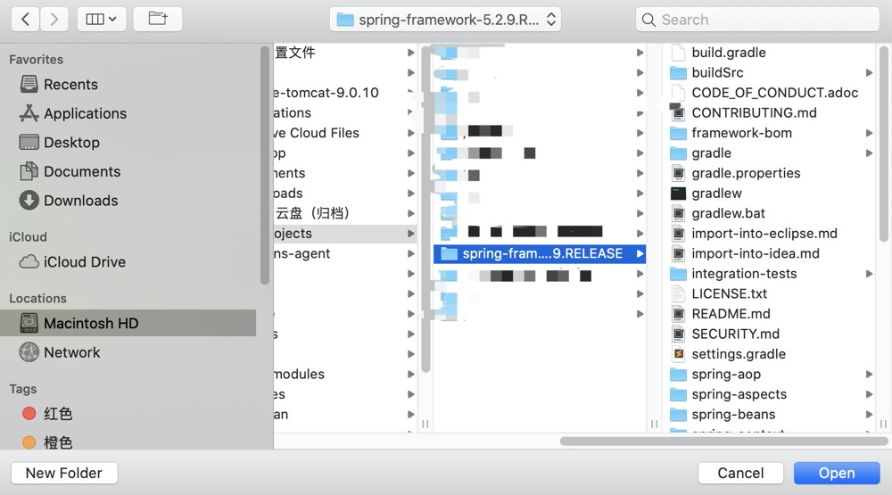

勾选自动导入和使用远程gradle wrapper

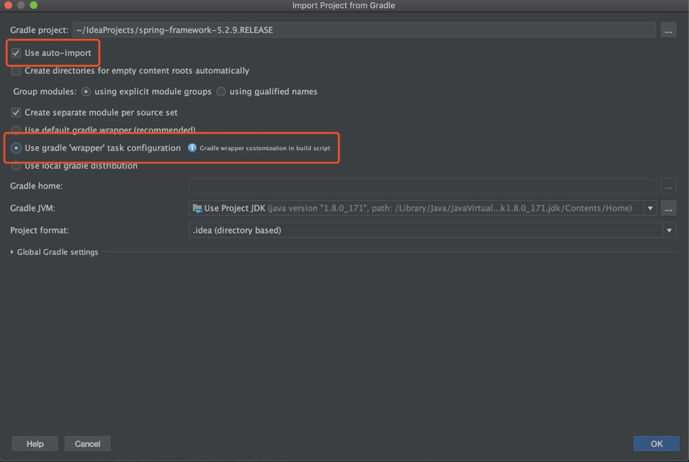

点击ok，导入到idea，进行编译

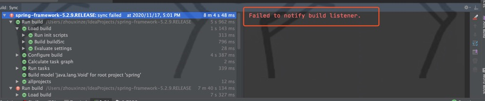

如果编译完显示这个，可能是因为你的idea和gradle版本不兼容

经过半天的测试发现：替换gradle还是会有问题，直接替换idea

编译完会显示：


#### 编译代码测试


##### 新建模块(选择gradle)

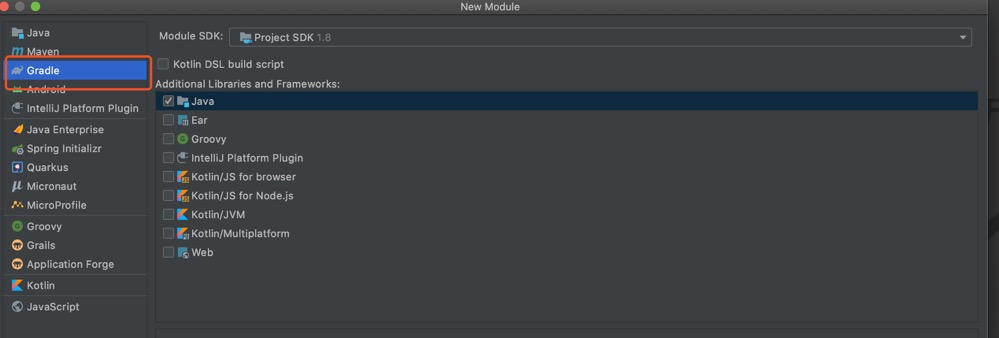


##### 编写代码测试IOC功能

1、添加依赖

compile(project(":spring-context"))代表本项目

```

dependencies {
    testCompile group: 'junit', name: 'junit', version: '4.12'
    compile(project(":spring-context"))
}

```

2、编写一个bean

```
@Service
public class UserServiceImpl implements UserService {

	@Override
	public void sayHi() {
		System.out.println("Hello Spring!");
	}
	
}
```


3、添加启动配置类

```
@ComponentScan("service")
public class MainStart {

	public static void main(String[] args) {

		ApplicationContext applicationContext = new AnnotationConfigApplicationContext(MainStart.class);
		UserService userService = applicationContext.getBean(UserServiceImpl.class);
		userService.sayHi();
	}
}
```

4、启动，正确输出，大功告成

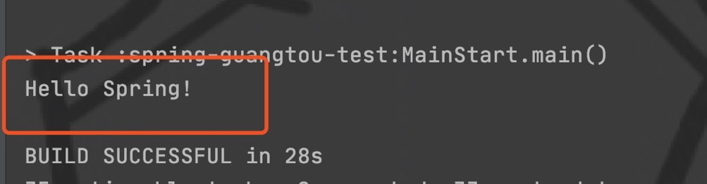


