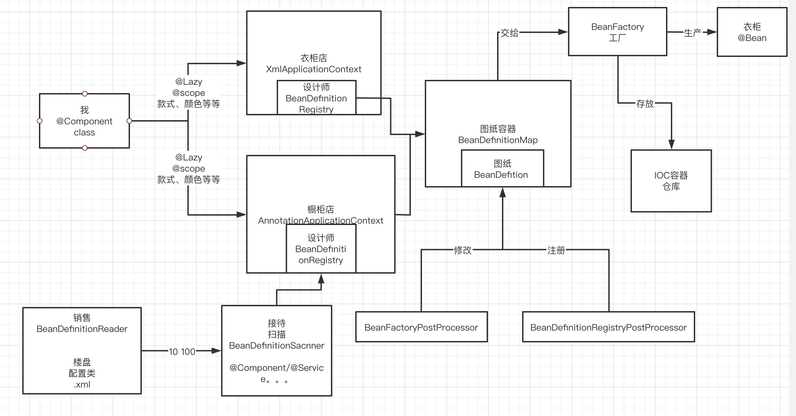
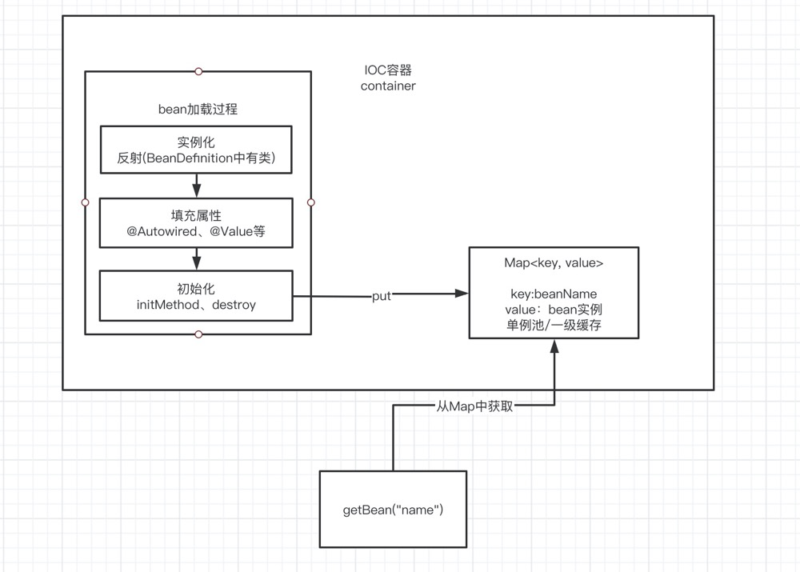
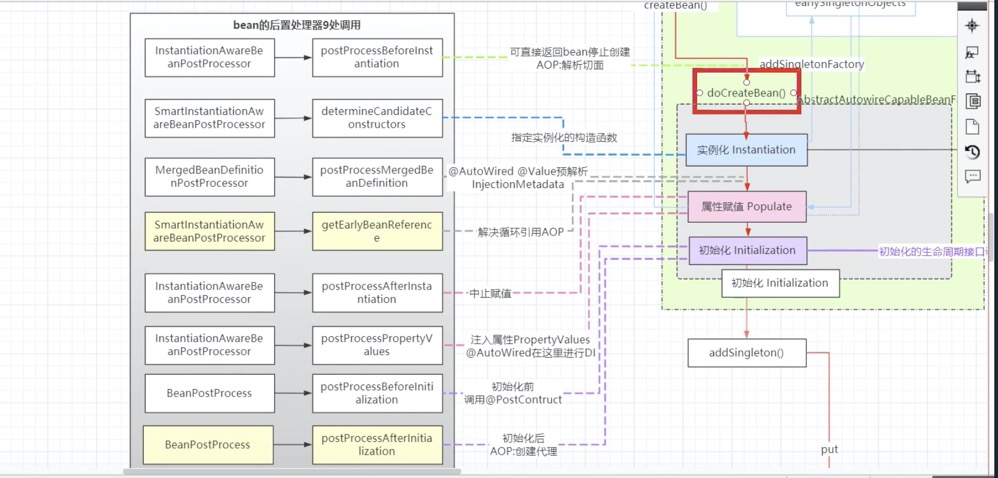
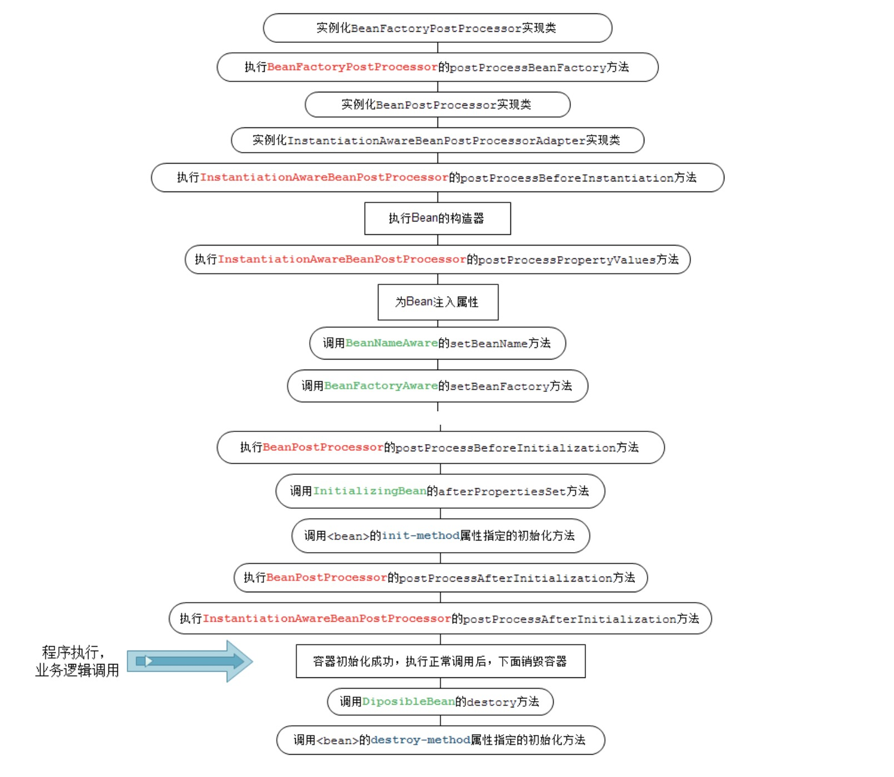
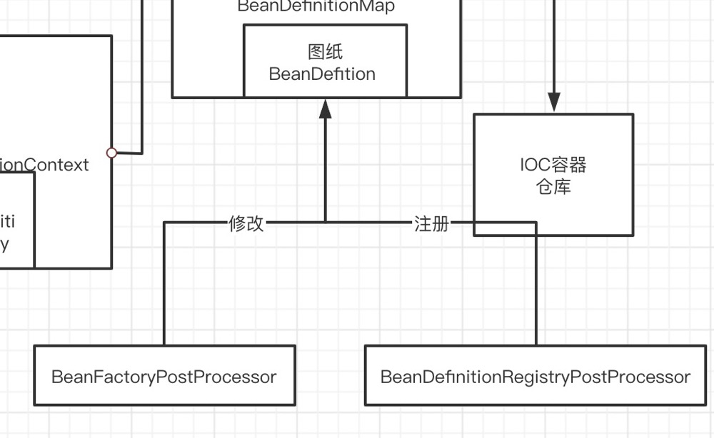

## Spring IOC 加载流程(一)

### 讲讲IOC容器

spring的核心之一就是IOC容器，容器我们都知道，是存储东西，但是什么是IOC，首先得知道为什么会有IOC以及IOC解决了一个什么样的问题？

### 什么是IOC？

IOC全称：Inversion of Control 控制反转，既然是控制翻转，那么就带来了谁控制了谁，反转到底是什么"骚操作"，从字面上看，IOC是一种思想，而不是具体的某件事物，所以我们得来看看IOC在spring中的应用场景。

### IOC在Spring中的应用场景

根据上篇文章中的体系划分，我们可以知道，IOC是出现在核心容器-Beans这个模块下，所以我们可以知道IOC这种思想和容器有千丝万缕的关系，所以我们从容器入手，找出上面两个问题的答案。

既然是容器，肯定是用来存放点啥的，在Spring中，容器中存放的就是一个个的bean，那么下面我引出一个问题，从这个问题来看IOC。

-------------------------------

#### 自问自答

如果对象A依赖了另外一个对象B，你一般首先想到的是怎么在创建对象A中创建对象B的？

我们下意识的想法肯定是在A中直接去new了一个B：

```
class A {
   B b = new B();
}
```

但是这种做法会带来一系列的问题：

- 一方面是会很零散，比如假设100个类依赖了B类，那么就需要替换这100个类（头发表示压力很大）

- 另外一方面，随着需求的迭代，这个100是会越来越大的，工作量是呈线性增长的，所以一旦替换后出现问题了，回滚回去的工作量也是不断上升的（要了老命了），同时也违反了开闭原则

所以为了解决上述这两种问题：大佬们提出了IOC概念

那么回过头来看，既然IOC是控制反转，我们必须得知道谁控制了谁，反转到底是什么"骚操作"。

-------------------------------

### 谁控制了谁，翻转又是什么"骚操作"

既然是控制翻转，肯定会有控制的“小伙伴”和被控制的“小伙伴”，那么对应的：控制的“小伙伴”就是A，被控制的“小伙伴”就是B，也就是说A主动去创建了B

那么翻转过后，就是B控制了A，A是被控制的“小伙伴”，也就是说，B主动把实例塞给了A

-------------------------------

### IOC的实现

既然提出了这个控制翻转（IOC）的思想，肯定就需要有一种对于这种思想的实现，所以这里就引出了DI（依赖注入）

#### DI帮我们做了什么

DI的目的其实就是把B的实例塞到了A，而不是A主动去创建B

-------------------------------

### 容器、IOC、DI之间的关系

- 容器同时管理着实例A和实例B

- 实例A如果依赖着B，那么是不需要主动去创建的，DI会把B主动塞到A身上，达到了控制翻转（IOC）的目的，这样做的好处是实例A对依赖的B的具体实现是无感知的，解决了层层之间的耦合问题

所以说：IOC和DI说的其实是一件事

因为spring的容器体现着IOC的思想，所以，文章的下半部分，spring的容器都简称IOC容器

 -------------------------------
 
 ### IOC容器中的主要成员以及相互之间的关系
 
 小伙伴们首先来看下面这张图：
 
 
 
 对应一个真实并且具体的业务场景：
 
 首先我是一个顾客，我想要买一个衣柜，我到衣柜店或者橱柜店去挑选，然后在衣柜店或者橱柜店的设计师根据我的特点（款式、颜色等等），做成一张衣柜的图纸放到图纸容器中，然后工厂从图纸容器中获取图纸生产衣柜并且存放到仓库
 
 这套流程就是我们把类变成bean的流程，对应到spring 中的成员就是：
 
- 我：用@Component或者其他方式声明的类
 
- 衣柜店/橱柜店：spring上下文
 
- 设计师：BeanDefinitionRegistry
 
- 图纸：BeanDefinition
 
- 工厂：BeanFactory
 
- 仓库：IOC容器

- 衣柜：bean
 
但是衣柜店/橱柜店不可能傻乎乎的等着顾客上门来，所以他一定会雇佣销售，让他去扫楼盘，看哪家哪户需要装修，所以楼盘就相当于我们的配置类.xml，在xml中配置从哪个包下面开始扫，就从哪个包下面开始扫，但是一个楼盘下不可能家家户户需要装修，所以还得筛选，这个筛选的工作就交给接待，也就是BeanDefinitionScanner，它来判断，如果一个类加上了@Component、@Service等标签，说明这个类需要成为一个Bean，然后交给BeanDefinitionRegistry注册成为一个bean定义

这套流程就是扫描类，把类变成bean定义的流程，对应到spring中的成员就是：
 
 - 销售：BeanDefinitionReader
 
 - 楼盘：配置类.xml
 
 - 接待：BeanDefinitionScanner

 但是如果在把图纸交给工厂之前，万一想添加一张图纸，或者想修改一下图纸，那么该怎么办呢？其实spring早就想好了：
 
 - 对图纸的修改口子：BeanFactoryPostProcess、BeanDefinitionRegistryPostProcess
 
 -------------------------------
 
### 我们从图中还能获得哪些信息？

- 不同的店也就是不同的ApplicationContext的区别其实只是把类注册成BeanDefinition不同，但是等到工厂把图纸变成bean的步骤都是相同的

-------------------------------

### Bean的加载过程

截止到目前，我们是收集了顾客的描述，并且把它注册成了一张张的图纸，现在我们就需要把图纸变成实物啦，也就是bean的加载过程

 

调用工厂的getBean方法其实就是开始Bean的创建，大致上来说就分为三大步：

- 1、实例化（反射BeanDefinition）

- 2、填充实例化出来的属性（@Autowired、@Value）

- 3、初始化（initMethod、destroy）

Bean加载完后就把bean放入缓存中，key是beanName，value为bean实例

其实每一步spring都做了很多事：

- 实例化的时候可以通过反射或者工厂方法（@Componenet、@Service）打上这些注解的，需要等到注册bean定义后交给BeanFactory通过反射来实例化，如果使用@Bean那么就通过工厂方法来生成一个bean（相比而言，@Bean的方式更加灵活），但是@Conponent、@Service等注解使用方便，各有利弊

- 填充属性的时候spring还通过三级缓存（其实就是三个Map）解决了bean之间循环依赖的问题

- bean的生命周期不止这些，但是这三步是核心，其他的我们以后会一一分析介绍
 
-------------------------------

### Bean的扩展点

#### 自问自答

如果在Bean的加载流程中，需要对Bean进行修修补补，该怎么办？

spring自有妙计，而这也是我认为IOC容器最有特色的地方：Bean的后置处理器（BeanPostProcessor）

Spring在创建Bean的生命过程中，用了大量的不同的后置处理器，共计9处：

 

这些在以后源码分析中，会细细讲解，现在只需要记住在生产Bean的过程中，会大量用到后置处理器即可

-------------------------------

### spring IOC容器的加载流程

第一步：BeanDefinitionReader读取配置并获取扫描的包路径

第二步：BeanDefinitionScanner扫描并筛选出需要注册成为bean的类

第三步：BeanDefinitionRegistry把类注册成为bean定义

第四步：调用工厂的getBean()方法把bean定义变成bean实例

Bean工厂的后置处理器和Bean的后置处理器先不放在这个流程中，等分析源码的时候一个一个分析

-------------------------------

### 篇末面试题

- 描述下BeanFactory

  BeanFactory，以Factory结尾，表示它是一个工厂类(接口)， 它负责生产和管理bean的一个工厂。BeanFactory是IOC容器的核心接口，它的职责包括：实例化、定位、配置应用程序中的对象及建立这些对象间的依赖。BeanFactory只是个接口，并不是IOC容器的具体实现，但是Spring容器给出了很多种实现，如 DefaultListableBeanFactory、XmlBeanFactory等。

2、BeanFactory和ApplicationContext的区别

  BeanFactory是一个简单工厂，只支持Bean的实例化，建立Bean之间的依赖等一些基础的功能。但是像一些AOP、Bean的后置处理器、Bean工厂的后置处理器等等一些扩展点，BeanFactory都是不支持的。
  
  ApplicationContext正是通过扩展点(后置处理器)的方式在BeanFactory的基础上丰富了功能：
  
  - MessageSource, 提供国际化的消息访问
  
  - 资源访问（如URL和文件）
  
  - 事件传递
  
  - Bean的自动装配
  
  - 各种不同应用层的Context实现

3、简述Spring IOC 的加载过程
   
   第一步：BeanDefinitionReader读取配置并获取扫描的包路径
   
   第二步：BeanDefinitionScanner扫描并筛选出需要注册成为bean的类
   
   第三步：BeanDefinitionRegistry把类注册成为bean定义
   
   第四步：调用工厂的getBean()方法把bean定义变成bean实例

4、简述Bean的生命周期
   
   
   
   图中的是完整的Bean的生命周期，这张图中包括了很多的后置处理器，共有9处，这些后置处理器我们会在后面一一分析
   
5、Spring中有哪些扩展接口以及调用时机

   首先就是工厂的后置处理器（主要是对Bean定义的一些注册和修改）：
   
   
   
   其次就是Bean的后置处理器（主要是对Bean的一些修修补补）
   
   
   
   具体各种后置处理器里面的细节，就等到我们后面一一分析  
   
 -------------------------------
 
 
 ### 本章小结
 
 其实本章没什么代码，先简单介绍了spring IOC容器中的各个成员，以及各个成员的作用和交互，初步了解了IOC容器的加载流程，下面的文章开始，
 从源码的角度分析Spring IOC的加载流程
 
 好了各位，以上就是这篇文章的全部内容了，愉快的时光总是这么短暂，能看到这里的人呀，都是人才。
 
 迷途小沙弥 | 文  【原创】
 
 如果本篇博客有任何错误，请批评指教，不胜感激 ！