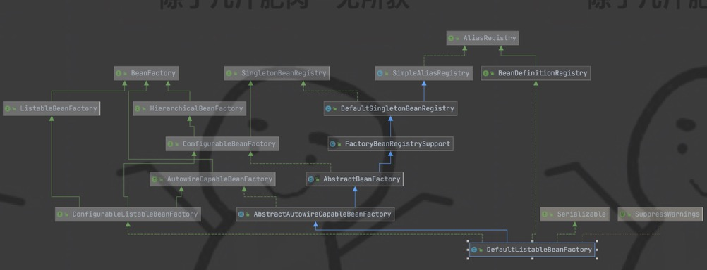
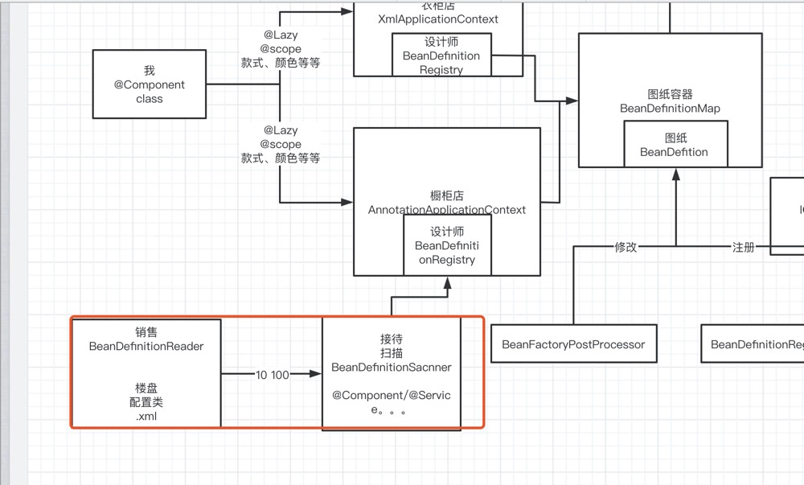

## Spring IOC 加载流程(二)

在上篇文章中，我们讲了spring加载的大致流程，所以从这篇文章开始，我们从源码的角度来看看，spring到底做了些啥。

--------------------------------

### spring IOC加载以及获取bean

```
AnnotationConfigApplicationContext context = new AnnotationConfigApplicationContext(xxx.class);

Car car = context.getBean("car", Car.class);

System.out.println(car.getName());
```

这就是一个简单的spring获取bean的示例代码，我们进到context.getBean("car", Car.class)方法的源码会发现，其实这个上下文就是一个门面模式，其实是从BeanFactory中获取

-------------------------------

### spring上下文的初始化

```
AnnotationConfigApplicationContext context = new AnnotationConfigApplicationContext(xxx.class);
```

进到构造方法里面发现，spring上下文的初始化大致上分为三步：

```
public AnnotationConfigApplicationContext(Class<?>... componentClasses) {

		// 调用构造函数
		this();
		// 注册我们的配置类
		register(componentClasses);
		// IOC容器刷新接口
		refresh();
}
```

#### 构造方法

首先我们来看看这个this方法里面的内容：

```
1.首先AnnotationConfigApplicationContext继承了GenericApplicationContext 所以会先去调用首先AnnotationConfigApplicationContext继承了GenericApplicationContext的无参构造函数

GenericApplicationContext的无参构造函数:

public GenericApplicationContext() {

	// 调用父类的构造函数，为ApplicationContext Spring上下文对象初始beanFactory
	// 为啥是DefaultListableBeanFactory，因为DefaultListableBeanFactory在BeanFactory中是功能是最全的
	this.beanFactory = new DefaultListableBeanFactory();

}
```

可以看到，在父类的无参构造函数中，我们就拿到了bean工厂，为啥要用DefaultListableBeanFactory，是因为它具有的bean工厂功能最丰富，同时它还实现了BeanDefinitionRegistry接口，这个接口我们在上篇文章中讲到过，是注册bean定义，DefaultListableBeanFactory实现了这个接口，也拥有了注册bean定义的能力。



```
2.接下来来看AnnotationConfigApplicationContext的无参构造函数：

public AnnotationConfigApplicationContext() {

	// 创建并读取注册的Bean定义读取器
	// 什么是bean定义？BeanDefinition
	// 完成了Spring内部BeanDefinition的注册（主要是后置处理器）
	this.reader = new AnnotatedBeanDefinitionReader(this);

	// 创建BeanDefinition扫描器
	// 可以用来扫描包或者类，并且转换成BeanDefinition
	this.scanner = new ClassPathBeanDefinitionScanner(this);
}
```

没错，我们要卖衣柜，首先肯定要让销售去楼盘扫描，看到底哪家哪户需要衣柜，扫完楼盘后，通过接待来扫描到底谁真正需要衣柜（哪些类是被配置成bean的）



##### Bean定义读取器

进入到AnnotatedBeanDefinitionReader也就是bean定义读取器中：

```
public AnnotatedBeanDefinitionReader(BeanDefinitionRegistry registry, Environment environment) {
	Assert.notNull(registry, "BeanDefinitionRegistry must not be null");
	Assert.notNull(environment, "Environment must not be null");
	// 把ApplicationContext对象赋值给AnnotatedBeanDefinitionReader
	this.registry = registry;
	// 用户处理条件注解 @Conditional
	this.conditionEvaluator = new ConditionEvaluator(registry, environment, null);
	// 注册内置的后置处理器
	AnnotationConfigUtils.registerAnnotationConfigProcessors(this.registry);
}
```

我们着重看最后一行代码(阅读源码时要抓重点，抛开细节)：注册内置的后置处理器


